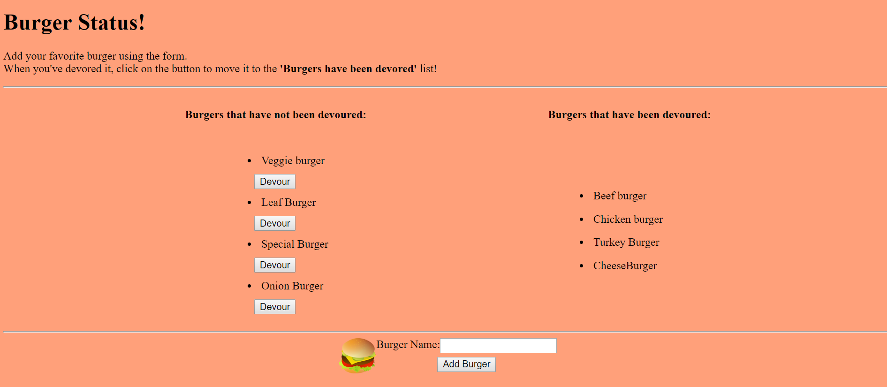

# The Burger Display App

June 2019

## About the Burger Display App

The burger app is about more than just burgers. It showcases GET, POST, and PUT requests using AJAX calls to interact with a database using the Model-View-Controller(MVC) architecture. The application uses callback functions in both the ORM, the models and the controllers to communicate request and response data, in this case the name of the burgers and a boolean variable about whether or not they've been devoured. 

This application also includes a custom ORM that as aforementioned communicates seamlessly with the model, the view(s), and the controller.

Stay tuned for the next iteration of the application which will use the popular Sequelize as the ORM.

## Running the Application

The application has been hosted [here.](https://gentle-eyrie-95201.herokuapp.com/) but it can also be run on a local server: PORT 8080.

To run the application via a command line use:

**nodemon server.js** 

## Output Screenshots 

See a quick screenshot of the output below:

